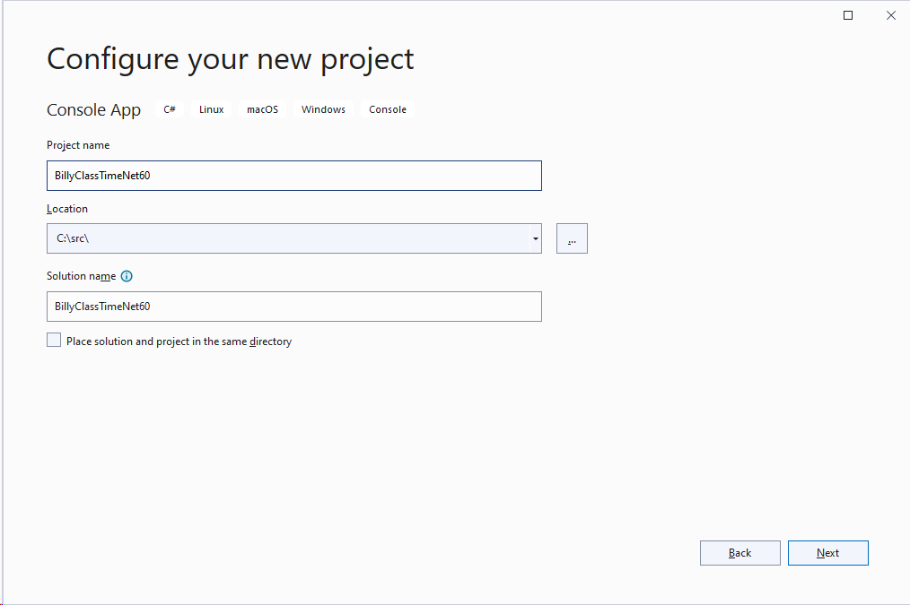

# Primeros pasos con Visual Studio 2022

Después de su lanzamiento mundial la semana pasada, he instalado la versión definitiva de visual studio 2022 y aqui os dejo mis revisiones:

## Instalación de .Net 6.0

Además del lanzamiento de Visual Studio 2022, también se llevó a cabo el lanzamiento de .Net 6.0, así que me he descargado la ultima versión del SDK de .Net 6.0 antes de instalar la de Visual Studio 2022.


Para revisar que versión de .Net 6.0 he instalado he ejecutado el comando de ```dotnet --info ```


En esta máquina sólo tengo .Net 6.0.100 SDK y .Net 6.0 de AspNetCore, de .Net y de Windows Desktop.


Una vez que he descargado la version Visual Studio 202 professional, procedo a su instalación, para esta prueba solo instalaré las opciones de desarrollo en escritorio y la plataforma universal de Windows. Para que sea rápida y no ocupe mucho espacio. Es una prueba :).


La ha realizado bastante rápido, tanto la descarga (que es debido a mi tarjeta de red, mi ancho de banda, etc) pero la instalación en la máquina  se nota que todo va a 64Bits, porque esta bastante mas rápida que VS2019.


Visual Studio 2022 ha quedado instalado y ahora es tiempo de comenzar a revisar sus novedades.


Creamos un proyecto de consola


Configuramos el proyecto de consola con nombre y carpeta de ubicación:




Elegimos el Framework, en este caso .Net 6.0 LTS.


Iniciamos el IDE de Visual Studio 2022


Activo el control de versiones, es decir ha instalado el plugin de git para Visual Studio 2022 por defecto. Mi repositorio será GitHub, por lo que autorizo a Visual Studio la conexión a GitHub.


Pongo un poco de código, para ver las estructuras, los defaults y otras cosas que explicaré en otro post y creo un repositorio.

**First Steps With Visual Studio 2022**


[Ultima parte](RemoviendoElDesorden.md) 
